<p align="center">
  
</p>

<p align="center">
  
</p>

<p align="center">
  <a href="https://ytalo-alves.netlify.app/">
    
  </a>
  <a href="mailto:ytaloalves09@gmail.com">
    
  </a>
  <a href="https://linkedin.com/in/ytalo-alves">
    
  </a>
  
</p>

<p align="center">
  
  
  
</p>

---

## `01. runtime_profile`

<table>
<tr>
<td width="58%">

```ts
export const ytalo = {
  role: "Analista de Sistemas",
  code: ["TypeScript", "Node.js", "React", "Expo"],
  domain: ["WMS", "ERP", "Logistica", "Processos"],
  mission: "reduzir ruido entre operacao e tecnologia",
  output: "software util, claro e conectado ao processo real",
}
```

</td>
<td width="42%">

**Sistema que eu gosto de construir**

- API com regra de negocio clara
- Interface objetiva para fluxo operacional
- Processo mapeado antes da solucao
- Teste funcional conectado ao uso real
- Comunicacao simples entre negocio, usuario e tecnologia

</td>
</tr>
</table>

---

## `02. command_center`

<table>
  <tr>
    <td width="25%" align="center">
      <br /><br />
      Node.js, Fastify, REST, validacao, Prisma e organizacao por casos de uso.
    </td>
    <td width="25%" align="center">
      <br /><br />
      React, Next.js, Vite, Tailwind e interfaces focadas em execucao.
    </td>
    <td width="25%" align="center">
      <br /><br />
      Expo, React Native, navegacao, consumo de APIs e experiencia multiplataforma.
    </td>
    <td width="25%" align="center">
      <br /><br />
      WMS, ERP, implantacao, go-live, treinamento e melhoria de processo.
    </td>
  </tr>
</table>

---

## `03. stack_matrix`

<p align="center">
  
  
  
  
  
</p>

<p align="center">
  
  
  
  
  
</p>

<p align="center">
  
  
  
  
  
</p>

---

## `04. selected_builds`

<p align="center">
  <a href="https://github.com/Ytalo-Alves/api-bank">
    
  </a>
  <a href="https://github.com/Ytalo-Alves/portifolio.dev">
    
  </a>
</p>

<p align="center">
  <a href="https://github.com/Ytalo-Alves/project-gym">
    
  </a>
  <a href="https://github.com/Ytalo-Alves/mobile_planner">
    
  </a>
</p>

---

## `05. telemetry`

<p align="center">
  
  
</p>

<p align="center">
  
</p>

<p align="center">
  
</p>

---

## `06. execution_protocol`

```txt
[diagnose]   entender operacao, dor, regra e excecao
[design]     transformar processo em fluxo simples
[develop]    construir API, interface e persistencia com clareza
[validate]   testar caminho real, dados, permissao e erro
[deliver]    documentar, treinar, acompanhar e evoluir
```

---

## `07. formation`

- **Analise e Desenvolvimento de Sistemas** - UNINOVE
- **Gestao da Cadeia de Suprimentos e Logistica** - Universidade Cruzeiro do Sul
- **Tecnico em Tecnologia da Informacao** - Instituto Tecnico Barueri

---

## `08. contact`

<p align="center">
  <a href="https://ytalo-alves.netlify.app/">
    
  </a>
  <a href="mailto:ytaloalves09@gmail.com">
    
  </a>
  <a href="https://linkedin.com/in/ytalo-alves">
    
  </a>
</p>


